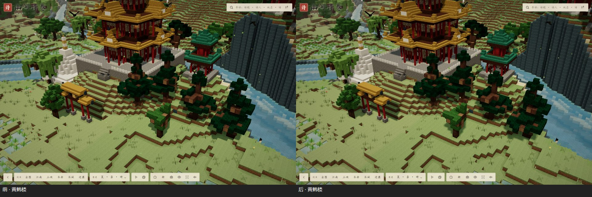
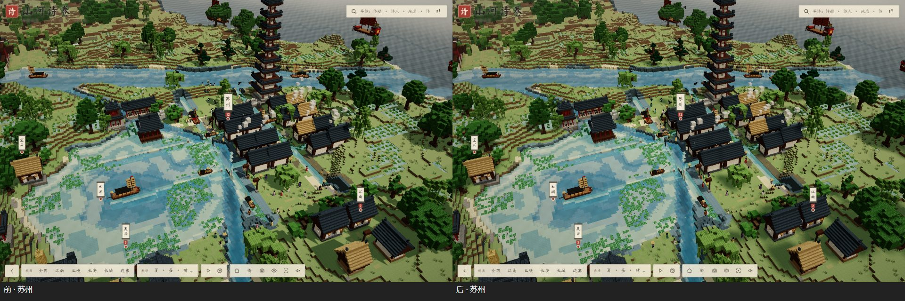
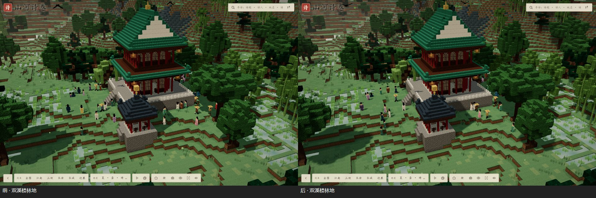
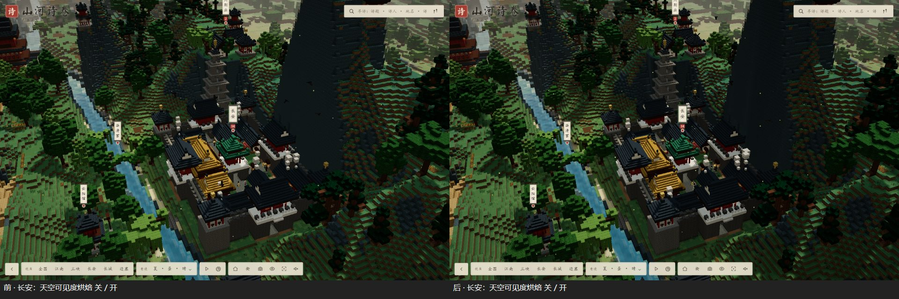

# 光照系统升级：前后对比

固定种子、固定机位（三处：黄鹤楼、苏州、双溪楼林地），画质「衡」，1440×900，夏季白昼晴。
每处等区块全部载入后连续采样 150 帧；再关掉阴影采样一次，两者之差即阴影通道的开销。
无头 Chrome（ANGLE / D3D11）同一台机器上跑，单次测量有 ±15% 左右的波动，下表为多次的平均。

## 结果（画质「衡」）

| 机位 | 帧率 前 → 后 | 帧耗时 前 → 后 | Draw Calls 前 → 后 | 其中阴影通道 前 → 后 | 阴影通道耗时 前 → 后 |
|---|---|---|---|---|---|
| 黄鹤楼 | 63.3 → 64.5 | 15.8 → 15.5 ms | 611 → 900 | 272 → 529 | 4.8 → 4.6 ms |
| 苏州 | 49.7 → 51.0 | 20.2 → 19.6 ms | 1418 → 1742 | 646 → 888 | 3.2 → 2.4 ms |
| 双溪楼林地 | 54.6 → 56.2 | 18.4 → 17.8 ms | 697 → 1104 | 221 → 546 | 3.1 → 1.8 ms |

「前」为 3 次、「后」为 2 次的平均。

- 两级级联让投影的物体要画两遍，阴影通道的 Draw Call 增加了；但每级阴影图从一张 2048 降到两张 1024，
  树叶只在近处投影、地被一律不投影，**阴影通道的耗时持平或更低，总帧率持平略升**。
- 「高」画质（三级级联、每级 2048，另加低强度 GTAO）：黄鹤楼 40.8 FPS、苏州 31.9 FPS、林地 43.9 FPS，
  阴影通道约 3–9 ms——作为高画质选项可以接受，低端机器建议用「衡」。

## 做了什么

1. **顶点 AO（体素网格生成时，Minecraft 式）**：原本已有每面四角 0–3 级 AO（取两侧与角上的方块，
   树叶也算遮挡，所以树冠内部、树干与地面交接、墙角、山体台阶都会暗下去）。这次补上：
   半砖顶、楼梯踏面等「方块内部的顶面」也按同层旁边的方块算 AO（以前这些面没有 AO）。
2. **面向明暗**：顶面 1.0、东西侧 0.87、南北侧 0.79、底面 0.6（着色器按法线乘入）。
3. **动态太阳**保持不变：晨昼暮夜改变太阳高度、方向、颜色、强度，月光同样投影。
4. **级联阴影（CSM）**：「衡」两级每级 1024、「高」三级每级 2048，级联之间渐变，阴影范围随镜头距离伸缩（最远约 700 格）；
   PCF 模糊半径让阴影边缘有柔和的半影；光源空间按像素对齐，镜头移动时阴影不爬动。
5. **不投影的东西**：草、芦苇、花、庄稼、荷（新的「地被层」，与树叶同材质但不投影）；远景区块、远景片一律不投影；
   树叶只在焦点 7 个区块（约 112 格）内投影，地形与建筑在整个近景圈内投影。
6. **光照贴图（预留、已可用）**：`engine/rendering/AmbientBaker.ts`。聚焦重点地标后，以它为中心 160 格见方，
   按每列（含建筑）的最高方块向八个方向看 12 格内的地平线，烘焙「天空可见度」。着色器只拿它乘**间接漫反射**，
   不含任何方向性的日光阴影，所以晨昼暮夜照常成立。效果：院落、檐下、楼与楼之间的环境光更暗（见下图长安一组）。
7. **0–15 级天空光 / 方块光数据结构（预留、已可用）**：`world/light/VoxelLight.ts`。每格一字节（高四位天空光、低四位方块光），
   按段懒分配；天空光从列顶以上的 15 向下、再向旁边逐格衰减（树叶、水多吸收 1），灯笼等发光方块为源向外衰减。
   目前只计算、不参与渲染，留给以后的洞穴与建筑内部。
8. **SSAO**：只在「高」画质开，混合强度 0.3、半径 1.2 格，只作低强度补充，不出黑边；主要的 AO 来自网格生成阶段。
9. 没有引入路径追踪、SSGI 或其他重型全局光照。

## 截图（左：升级前；右：升级后）

长安：天空可见度烘焙关（左）与开（右）——城中院落、墙根、殿宇之间的环境光变暗，日照面不变。

## 复测

测量脚本思路：`window.__shanhe.engine` 上把镜头飞到地标的固定姿态，等区块载入完成，
用 `renderer.info`（关掉 `autoReset` 累计多帧）统计 Draw Call 与三角形，`requestAnimationFrame` 间隔统计帧时；
`engine.__shadowToggle(false)` 关阴影再测一次得到阴影通道开销。
